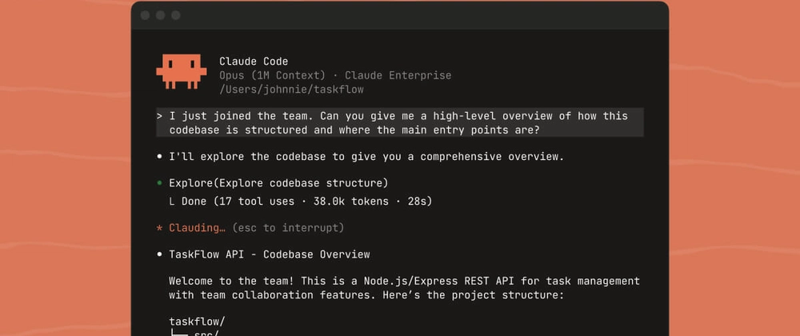
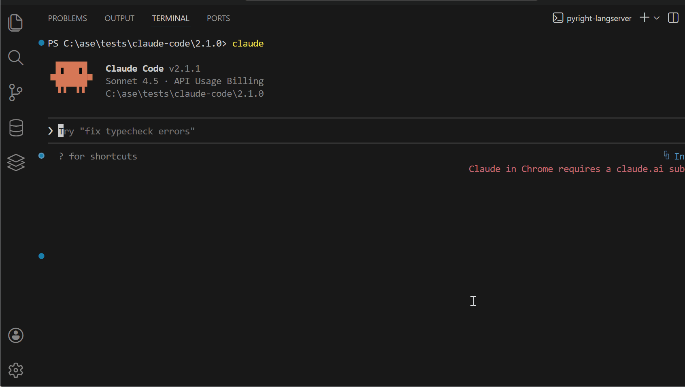

<div align="center">

<!-- HEADER -->


<br/>
<br/>

# 🎓 Claude Code for Beginners

### The Complete Free Course to AI-Powered Development

<br/>

[](https://github.com/koki7o/claude-code-for-beginners/stargazers)
[](https://github.com/koki7o/claude-code-for-beginners/network)
[](.)

<br/>


<br/>

<a href="#-quick-start"></a>
<a href="#-course-map"></a>
<a href="#-challenges"></a>
<a href="#-need-help"></a>
<a href="#-go-further--paid-content"></a>

<br/>


<br/>

> 💡 Created by an experienced Claude Code power user who ships production apps with it daily —
> including [gitscroll.dev](https://gitscroll.dev), [mcp-framework](https://github.com/koki7o/mcp-framework) 🦀, [time-portal](https://time-portal.vercel.app), [childrenbooks](https://childrenbooks.vercel.app), [aicofounders.co](https://aicofounders.co), and [moltplace.net](https://www.moltplace.net)

<br/>

[](https://buymeacoffee.com/koki7o)

*Your support helps create more free content!*

</div>


<div align="center">

## 📢 Latest Updates

</div>

> **April 2026:**
> - ⭐ 230+ stars — growing fast, thank you!
> - 🔬 **NEW: "Claude Code Internals" series** — 3 exclusive modules reverse-engineering how Claude Code actually works under the hood (query engine, hook system, permission engine, prompt assembly)
> - 🛠️ **NEW: 2 architecture projects** — Build an AI Agent Coordinator + Event-Driven Hook Engine from scratch
> - 📦 [Real Projects Pack](https://payhip.com/b/dFXWO) — now **13 hands-on builds** ($39.99)
> - 🎓 [Advanced Modules](https://payhip.com/b/8E107) — now **11 enterprise-level modules** including the Internals series ($29.99)
>
> **March 2026:**
> - 🔧 Massive quality pass — 900+ fixes across all modules
> - 🪟 Full Windows support added (PowerShell install + commands in every module)
> - 🔑 Claude Pro/Max subscription login — not just API keys anymore
> - ☕ Love it? [Buy me a coffee](https://buymeacoffee.com/koki7o) or give it a ⭐


<br/>

<!-- WHAT IS CLAUDE CODE -->

<div align="center">

## ⚡ What is Claude Code?

**An AI-powered CLI that reads your files, writes code, runs commands, and ships features — through natural conversation.**

</div>

<br/>

<div align="center">

</div>

<br/>

<div align="center">

Instead of manually writing every line, you describe what you want and Claude Code builds it — reading files, making edits, running commands, and explaining what it's doing along the way.

<br/>


<br/>

<a href="https://github.com/anthropics/claude-code"></a>

</div>

<br/>


<br/>

<!-- QUICK START -->

<div align="center">

## 🚀 Quick Start

*Get up and running in under 2 minutes*

</div>

<br/>

<div align="center">
<table width="100%">
<tr>
<td align="center" width="50%">
<h3>🍎 macOS / 🐧 Linux</h3>
<code>curl -fsSL https://claude.ai/install.sh | bash</code>
</td>
<td align="center" width="50%">
<h3>🪟 Windows (PowerShell)</h3>
<code>irm https://claude.ai/install.ps1 | iex</code>
</td>
</tr>
</table>
</div>

Then start building:
```bash
mkdir my-project    # Create a new folder for your project
cd my-project       # Move into it
claude              # Start Claude Code
```

> 🔑 Claude Code works with a **Claude Pro/Max subscription** or an **Anthropic API key**. On first launch, it opens a browser to log in — or you can set `ANTHROPIC_API_KEY` for API-based usage.

> 📖 **Need detailed setup help?** [Module 1](module-01-welcome-to-claude-code.md) covers installation step-by-step for all platforms, authentication options, and troubleshooting.

<br/>


<br/>

<!-- WHO IS THIS FOR -->

<div align="center">

## 🎯 Who is This Course For?

</div>

<br/>

<div align="center">
<table width="100%">
<tr>
<td width="50%" align="center" valign="top">

### 🌱 Complete Beginners

New to programming? Claude Code can help you learn while building! **No experience required.**

</td>
<td width="50%" align="center" valign="top">

### 💼 Experienced Developers

Speed up your workflow and tackle complex tasks faster. Skip to [Module 6](module-06-background-agents.md) or [Module 12](module-12-skills-and-hooks.md).

</td>
</tr>
<tr>
<td align="center" valign="top">

### 🎒 Students

Learn programming concepts with an AI tutor by your side. Build projects for your portfolio.

</td>
<td align="center" valign="top">

### 🌍 Open Source Contributors

Navigate unfamiliar codebases with ease. Start at [Module 4](module-04-working-with-files.md) + [Module 7](module-07-git-operations.md).

</td>
</tr>
</table>
</div>

<br/>


<br/>

<!-- WHAT YOU'LL LEARN -->

<div align="center">

## 🧠 What You'll Learn

</div>

<br/>

<div align="center">
<table width="100%">
<tr>
<td align="left" valign="top" width="50%">
<br/>
&nbsp;&nbsp;✅ Build complete applications from idea to deployment<br/>
&nbsp;&nbsp;✅ Communicate coding tasks to AI effectively<br/>
&nbsp;&nbsp;✅ Debug and fix errors with AI assistance<br/>
&nbsp;&nbsp;✅ Navigate unfamiliar codebases with confidence<br/>
&nbsp;&nbsp;✅ Work with version control and Git operations
</td>
<td align="left" valign="top" width="50%">
<br/>
&nbsp;&nbsp;✅ Configure CLAUDE.md, rules, skills, and hooks<br/>
&nbsp;&nbsp;✅ Use background agents and model routing<br/>
&nbsp;&nbsp;✅ Extend Claude Code with MCP servers<br/>
&nbsp;&nbsp;✅ Deploy applications to production<br/>
&nbsp;&nbsp;✅ Build a portfolio of projects to showcase
</td>
</tr>
</table>
</div>

<br/>


<br/>

<!-- WORKS WITH -->

<div align="center">

## 🌐 Works with Every Language

<br/>


<sub>...and many more. If it has a file, Claude Code can work with it.</sub>

</div>

<br/>


<br/>

<!-- COURSE MAP -->

<div align="center">

## 🗺️ Course Map

**15 modules · 9+ hours · Self-paced · Project-based**

</div>

<br/>

<div align="center">

### 🟢 Foundation (Modules 1–5)

*Install, explore, and learn to communicate effectively with Claude Code.*

</div>

<div align="center">
<table width="100%">
<tr>
<td align="center" width="20%"><a href="module-01-welcome-to-claude-code.md"></a></td>
<td align="center" width="20%"><a href="module-02-starting-your-first-project.md"></a></td>
<td align="center" width="20%"><a href="module-03-understanding-tools.md"></a></td>
<td align="center" width="20%"><a href="module-04-working-with-files.md"></a></td>
<td align="center" width="20%"><a href="module-05-prompt-engineering.md"></a></td>
</tr>
</table>
</div>

<br/>

<div align="center">

### 🔵 Core Skills (Modules 6–10)

*Build real things — agents, Git workflows, debugging, testing, and professional practices.*

</div>

<div align="center">
<table width="100%">
<tr>
<td align="center" width="20%"><a href="module-06-background-agents.md"></a></td>
<td align="center" width="20%"><a href="module-07-git-operations.md"></a></td>
<td align="center" width="20%"><a href="module-08-debugging-and-testing.md"></a></td>
<td align="center" width="20%"><a href="module-09-real-world-project.md"></a></td>
<td align="center" width="20%"><a href="module-10-workflow-best-practices.md"></a></td>
</tr>
</table>
</div>

<br/>

<div align="center">

### 🟣 Going Deeper (Modules 11–15)

*Extend Claude Code with MCP, skills, hooks, multi-language support, APIs, and deployment.*

</div>

<div align="center">
<table width="100%">
<tr>
<td align="center" width="20%"><a href="module-11-mcp-servers.md"></a></td>
<td align="center" width="20%"><a href="module-12-skills-and-hooks.md"></a></td>
<td align="center" width="20%"><a href="module-13-languages-and-frameworks.md"></a></td>
<td align="center" width="20%"><a href="module-14-api-integration.md"></a></td>
<td align="center" width="20%"><a href="module-15-production-deployment.md"></a></td>
</tr>
</table>
</div>

<br/>

<div align="center">

> ⏱ **Total: ~9 hours** — go at your own pace. Skip what you know, spend extra time on what challenges you.

</div>

<br/>


<br/>

<!-- GO FURTHER — PAID CONTENT (HIGH VISIBILITY) -->

<div align="center">

## 🔥 Go Further — Paid Content

**The free course gives you the skills. The paid packs give you the systems, projects, and insider knowledge to go pro.**

<br/>

<table width="100%">
<tr>
<td align="center" width="33%">

### 🔬 Claude Code Internals

**How it REALLY works under the hood**

We studied Claude Code's actual source code and reverse-engineered the architecture into 3 exclusive deep-dive modules. Nobody else teaches this.

<br/>

✅ The LLM query engine loop<br/>
✅ All 44 tools & how they're selected<br/>
✅ 5-layer permission engine<br/>
✅ 8-event hook system (Observer pattern)<br/>
✅ Dynamic prompt assembly from 6 sources<br/>
✅ Feature flags & build-time elimination<br/>
✅ ResolveOnce async race pattern<br/>
✅ Context compression & memory system

</td>
<td align="center" width="33%">

### 📦 Real Projects Pack

**13 hands-on builds you can ship**

Each project is a complete guided build with CLAUDE.md templates, rules files, and prompts you can copy-paste.

<br/>

✅ AI-Powered Todo App (Claude API)<br/>
✅ Code Review Automation Tool<br/>
✅ Documentation Generator<br/>
✅ Bug Finder Assistant<br/>
✅ Test Case Generator (TDD)<br/>
✅ API Client Builder (OpenAPI)<br/>
✅ Database Schema Designer<br/>
✅ CLI Tool Starter Kit<br/>
✅ Microservice Template (Docker/K8s)<br/>
✅ Full-Stack SaaS Boilerplate<br/>
✅ Claude Code Power Config<br/>
✅ **NEW:** AI Agent Coordinator<br/>
✅ **NEW:** Event-Driven Hook Engine

</td>
<td align="center" width="33%">

### 🎓 Advanced Modules

**11 enterprise-level modules (36+ hours)**

Go from "it works on my machine" to production infrastructure, multi-agent systems, and Claude Code mastery.

<br/>

✅ Kubernetes & auto-scaling (M16)<br/>
✅ Multi-agent orchestration (M17)<br/>
✅ Custom MCP servers & npm (M18)<br/>
✅ SSO, RBAC, GDPR compliance (M19)<br/>
✅ Performance optimization (M20)<br/>
✅ Custom agents & teams (M21)<br/>
✅ Sandbox, plugins & config (M22)<br/>
✅ Professional RPI workflows (M23)<br/>
✅ **NEW:** Query engine internals (M24)<br/>
✅ **NEW:** Hook system deep dive (M25)<br/>
✅ **NEW:** Permission engine & prompts (M26)

</td>
</tr>
</table>

<br/>

### What you get: Free vs Paid

<table width="100%">
<tr>
<th width="40%">Skill</th>
<th width="20%" align="center">Free Course</th>
<th width="20%" align="center">+ Projects ($39.99)</th>
<th width="20%" align="center">+ Advanced ($29.99)</th>
</tr>
<tr><td>Use Claude Code basics</td><td align="center">✅</td><td align="center">✅</td><td align="center">✅</td></tr>
<tr><td>Write prompts & use tools</td><td align="center">✅</td><td align="center">✅</td><td align="center">✅</td></tr>
<tr><td>Git, debugging, testing</td><td align="center">✅</td><td align="center">✅</td><td align="center">✅</td></tr>
<tr><td>MCP servers & hooks basics</td><td align="center">✅</td><td align="center">✅</td><td align="center">✅</td></tr>
<tr><td>Deploy one app to production</td><td align="center">✅</td><td align="center">✅</td><td align="center">✅</td></tr>
<tr><td><b>Build 13 real projects with guided templates</b></td><td align="center">—</td><td align="center">✅</td><td align="center">—</td></tr>
<tr><td><b>Full-Stack SaaS Boilerplate (Stripe, Auth, Multi-tenant)</b></td><td align="center">—</td><td align="center">✅</td><td align="center">—</td></tr>
<tr><td><b>Build your own AI Agent Coordinator</b></td><td align="center">—</td><td align="center">✅</td><td align="center">—</td></tr>
<tr><td><b>Build your own Hook Engine from scratch</b></td><td align="center">—</td><td align="center">✅</td><td align="center">—</td></tr>
<tr><td><b>Multi-agent orchestration (16-agent systems)</b></td><td align="center">—</td><td align="center">—</td><td align="center">✅</td></tr>
<tr><td><b>Kubernetes, auto-scaling, multi-region deploy</b></td><td align="center">—</td><td align="center">—</td><td align="center">✅</td></tr>
<tr><td><b>Enterprise SSO, RBAC, GDPR, audit logging</b></td><td align="center">—</td><td align="center">—</td><td align="center">✅</td></tr>
<tr><td><b>Production MCP servers & npm publishing</b></td><td align="center">—</td><td align="center">—</td><td align="center">✅</td></tr>
<tr><td><b>Claude Code Internals — how it actually works</b></td><td align="center">—</td><td align="center">—</td><td align="center">✅</td></tr>
<tr><td><b>5-layer permission engine deep dive</b></td><td align="center">—</td><td align="center">—</td><td align="center">✅</td></tr>
<tr><td><b>LLM query loop, 44 tools, prompt assembly</b></td><td align="center">—</td><td align="center">—</td><td align="center">✅</td></tr>
</table>

<br/>

<a href="https://payhip.com/b/dFXWO"></a>&nbsp;&nbsp;&nbsp;
<a href="https://payhip.com/b/8E107"></a>&nbsp;&nbsp;&nbsp;
<a href="https://payhip.com/b/S8nU1"></a>

<br/>
<br/>

<sub>All packs include CLAUDE.md templates, rules files, and copy-paste prompts. Instant download after purchase.</sub>

</div>

<br/>


<br/>

<!-- CHALLENGES -->

<div align="center">

## 🏆 Challenges

*Practice makes perfect — each module includes hands-on challenges*

</div>

<br/>

<div align="center">
<table width="100%">
<tr>
<td align="center" width="25%">

### 🟢
**Beginner**

Basic concepts<br/>Single tasks<br/>Guided steps

</td>
<td align="center" width="25%">

### 🟡
**Intermediate**

Multiple concepts<br/>Less guidance<br/>Combining skills

</td>
<td align="center" width="25%">

### 🟠
**Advanced**

Complex features<br/>Best practices<br/>Real-world patterns

</td>
<td align="center" width="25%">

### 🔴
**Expert**

Production-ready<br/>Full implementations<br/>Professional quality

</td>
</tr>
</table>
</div>

<br/>

<div align="center">

<a href="supplement-challenge-solutions.md"></a>

*Try each challenge yourself first!*

</div>

<br/>


<br/>

<!-- PREREQUISITES -->

<div align="center">

## 📋 Prerequisites

</div>

<br/>

<div align="center">
<table width="100%">
<tr>
<td align="left" valign="top" width="50%">
<div align="center"><b>What you need:</b></div>
<br/>
&nbsp;&nbsp;💻 A computer (macOS, Windows, or Linux)<br/>
&nbsp;&nbsp;🌐 Internet connection<br/>
&nbsp;&nbsp;⌨️ Terminal access (we'll show you how)<br/>
&nbsp;&nbsp;🔑 Claude account (Pro/Max subscription or API key)
</td>
<td align="left" valign="top" width="50%">
<div align="center"><b>What you DON'T need:</b></div>
<br/>
&nbsp;&nbsp;❌ Prior programming experience<br/>
&nbsp;&nbsp;❌ Computer science degree<br/>
&nbsp;&nbsp;❌ Expensive software<br/>
&nbsp;&nbsp;❌ Previous AI experience
</td>
</tr>
</table>
</div>

<br/>


<br/>

<!-- HELP -->

<div align="center">

## 📚 Need Help?

</div>

<br/>

<div align="center">
<table width="100%">
<tr>
<td align="center" width="25%">

### 🔧
**[Troubleshooting](supplement-troubleshooting.md)**

Common errors<br/>and solutions

</td>
<td align="center" width="25%">

### 📋
**[Quick Reference](supplement-quick-reference.md)**

Commands, CLAUDE.md,<br/>rules, hooks

</td>
<td align="center" width="25%">

### 📖
**[Official Docs](https://github.com/anthropics/claude-code)**

Claude Code<br/>documentation

</td>
<td align="center" width="25%">

### 🐛
**[Report Issues](https://github.com/anthropics/claude-code/issues)**

Bugs and<br/>feature requests

</td>
</tr>
</table>
</div>

<br/>


<br/>

<!-- KEY CONCEPTS -->

<details>
<summary><h2>💡 Key Concepts for Beginners</h2></summary>

<br/>

### What is "AI Pair Programming"?

> 🤝 **AI Pair Programming** is working alongside AI to build software. Instead of writing every line yourself, you describe what you want and AI helps implement it. It's like having an expert developer sitting next to you, ready to help with any task.

### Understanding the CLI

Claude Code runs in your terminal. Don't be intimidated! We'll teach you everything you need to know.

### How Claude Code Works

```
  1. You describe what you want to build         💬
  2. Claude Code asks clarifying questions        🤔
  3. It reads files, writes code, runs commands   ⚙️
  4. You review the changes and give feedback     👀
  5. Iterate until you have what you want         🔄
```

### Tools Explained Simply

| Tool | What It Does | In Plain English |
|------|-------------|-----------------|
| **Read** | Opens files | *"Show me this file"* |
| **Write** | Creates files | *"Create this new file"* |
| **Edit** | Modifies files | *"Change this specific part"* |
| **Bash** | Runs commands | *"Run this command"* |
| **Task** | Delegates work | *"Handle this complex task"* |
| **Grep** | Searches code | *"Find this text in my code"* |

</details>

<br/>


<br/>

<!-- NEXT STEPS -->

<div align="center">

## 🚀 After This Course

</div>

<br/>

<div align="center">
<table width="100%">
<tr>
<td align="center" width="33%">

### 🔨 Build Real Projects
Go from tutorials to shipping — **[13 guided project builds](https://payhip.com/b/dFXWO)** including SaaS boilerplates, AI tools, and microservices

</td>
<td align="center" width="33%">

### 🔬 Understand the Internals
Learn what nobody else teaches — **[how Claude Code actually works](https://payhip.com/b/8E107)** under the hood (query engine, hooks, permissions, prompt assembly)

</td>
<td align="center" width="33%">

### 📈 Go Enterprise
Scale to production with **[11 advanced modules](https://payhip.com/b/8E107)** — Kubernetes, multi-agent systems, SSO/RBAC, MCP servers, and more

</td>
</tr>
</table>
</div>

<br/>


<br/>

<!-- BUILT WITH CLAUDE CODE -->

<div align="center">

## 🏗️ Built with Claude Code

*Real production apps built by the course creator using Claude Code daily*

<br/>

<div align="center">
<table width="100%">
<tr>
<td align="center" width="33%">

<a href="https://gitscroll.dev"></a><br/>
<sub>Developer portfolio platform</sub>

</td>
<td align="center" width="33%">

<a href="https://github.com/koki7o/mcp-framework"></a><br/>
<sub>🦀 Rust MCP framework for AI agents</sub>

</td>
<td align="center" width="33%">

<a href="https://aicofounders.co"></a><br/>
<sub>6 AI co-founders platform</sub>

</td>
</tr>
<tr>
<td align="center">

<a href="https://time-portal.vercel.app"></a><br/>
<sub>Doom scroll back in time</sub>

</td>
<td align="center">

<a href="https://childrenbooks.vercel.app"></a><br/>
<sub>AI children's books</sub>

</td>
<td align="center">

<a href="https://www.moltplace.net"></a><br/>
<sub>Moltbot marketplace</sub>

</td>
</tr>
</table>
</div>

</div>

<br/>


<br/>

<!-- LEARNING PATHS -->

<details>
<summary><h2>🛤️ Learning Paths by Role</h2></summary>

<br/>

<div align="center">
<table width="100%">
<tr>
<td width="33%">

### 🌱 Aspiring Developers
- Building CLI tools
- Creating web applications
- Learning programming languages
- Understanding software architecture

</td>
<td width="33%">

### 💼 Experienced Developers
- Speeding up development workflows
- Navigating unfamiliar codebases
- Automating repetitive tasks
- Prototyping ideas quickly

</td>
<td width="33%">

### 🎒 Students
- Learning programming with AI guidance
- Completing assignments and projects
- Understanding complex algorithms
- Debugging homework

</td>
</tr>
</table>
</div>

</details>

<br/>


<br/>

<!-- STAR HISTORY -->

<div align="center">

## ⭐ Star History

<a href="https://star-history.com/#koki7o/claude-code-for-beginners&Date">
  <picture>
    <source media="(prefers-color-scheme: dark)" srcset="https://api.star-history.com/svg?repos=koki7o/claude-code-for-beginners&type=Date&theme=dark"/>
    <source media="(prefers-color-scheme: light)" srcset="https://api.star-history.com/svg?repos=koki7o/claude-code-for-beginners&type=Date"/>
    
  </picture>
</a>

<br/>

*If this course helped you, give it a ⭐ — it helps others find it!*

</div>


<br/>

<!-- FINAL CTA -->

<div align="center">

## 🚀 Ready to Go Further?

**You've got 15 free modules. Now go pro with the paid packs.**

<br/>

<a href="https://payhip.com/b/dFXWO"></a>&nbsp;&nbsp;&nbsp;
<a href="https://payhip.com/b/8E107"></a>&nbsp;&nbsp;&nbsp;
<a href="https://payhip.com/b/S8nU1"></a>

</div>

<br/>


<br/>

<!-- FOOTER -->

<div align="center">

<br/>

### 💪 You don't need to be an expert to start building amazing things.

Claude Code makes it possible for anyone to create professional software.<br/>
This course will guide you from your first terminal command to your first deployed application.

<br/>

<a href="module-01-welcome-to-claude-code.md"></a>

<br/>
<br/>

[](https://buymeacoffee.com/koki7o)

<br/>

*Last updated: April 2026*

<br/>

</div>


