<div align="center">

<!-- HEADER -->


<br/>
<br/>

# 🎓 Claude Code for Beginners

### The Complete Free Course to AI-Powered Development

<br/>

[](https://github.com/koki7o/claude-code-for-beginners/stargazers)
[](https://github.com/koki7o/claude-code-for-beginners/network)
[](.)

<br/>


<br/>

<a href="#-quick-start"></a>
<a href="#-course-map"></a>
<a href="#-challenges"></a>
<a href="#-need-help"></a>

<br/>
<br/>

> 💡 Created by an experienced Claude Code power user who ships production apps with it daily —
> including [gitscroll.dev](https://gitscroll.dev), [mcp-framework](https://github.com/koki7o/mcp-framework) 🦀, [time-portal](https://time-portal.vercel.app), [childrenbooks](https://childrenbooks.vercel.app), [aicofounders.co](https://aicofounders.co), and [moltplace.net](https://www.moltplace.net)

<br/>

[](https://buymeacoffee.com/koki7o)

*Your support helps create more free content!*

</div>

<br/>

---

<br/>

<!-- WHAT IS CLAUDE CODE -->

<div align="center">

## ⚡ What is Claude Code?

**An AI-powered CLI that reads your files, writes code, runs commands, and ships features — through natural conversation.**

</div>

<br/>

```
  You:         "Create a REST API with authentication and PostgreSQL"
                                    ⬇️
  Claude Code:  📁 Creates project structure
                📦 Installs dependencies
                💻 Writes application code
                🧪 Runs tests
                ✅ Done.
```

<br/>

<div align="center">

Instead of manually writing every line, you describe what you want and Claude Code builds it — reading files, making edits, running commands, and explaining what it's doing along the way.

<br/>

<a href="https://github.com/anthropics/claude-code"></a>

</div>

<br/>

---

<br/>

<!-- QUICK START -->

<div align="center">

## 🚀 Quick Start

*Get up and running in under 2 minutes*

</div>

<br/>

<div align="center">
<table width="100%">
<tr>
<td width="50%">

### 🍎 macOS / 🐧 Linux

```bash
curl -fsSL https://claude.ai/install.sh | bash
```

</td>
<td width="50%">

### 🪟 Windows (PowerShell)

```powershell
irm https://claude.ai/install.ps1 | iex
```

</td>
</tr>
</table>
</div>

Then start building:
```bash
mkdir my-project    # Create a new folder for your project
cd my-project       # Move into it
claude              # Start Claude Code
```

> 🔑 Claude Code works with a **Claude Pro/Max subscription** or an **Anthropic API key**. On first launch, it opens a browser to log in — or you can set `ANTHROPIC_API_KEY` for API-based usage.

> 📖 **Need detailed setup help?** [Module 1](module-01-welcome-to-claude-code.md) covers installation step-by-step for all platforms, authentication options, and troubleshooting.

<br/>

---

<br/>

<!-- WHO IS THIS FOR -->

<div align="center">

## 🎯 Who is This Course For?

</div>

<br/>

<div align="center">
<table width="100%">
<tr>
<td width="50%" align="center">

### 🌱 Complete Beginners

New to programming? Claude Code can help you learn while building! **No experience required.**

</td>
<td width="50%" align="center">

### 💼 Experienced Developers

Speed up your workflow and tackle complex tasks faster. Skip to [Module 6](module-06-background-agents.md) or [Module 12](module-12-skills-and-hooks.md).

</td>
</tr>
<tr>
<td align="center">

### 🎒 Students

Learn programming concepts with an AI tutor by your side. Build projects for your portfolio.

</td>
<td align="center">

### 🌍 Open Source Contributors

Navigate unfamiliar codebases with ease. Start at [Module 4](module-04-working-with-files.md) + [Module 7](module-07-git-operations.md).

</td>
</tr>
</table>
</div>

<br/>

---

<br/>

<!-- WHAT YOU'LL LEARN -->

<div align="center">

## 🧠 What You'll Learn

</div>

<br/>

<div align="center">
<table width="100%">
<tr>
<td width="50%">

✅ Build complete applications from idea to deployment<br/>
✅ Communicate coding tasks to AI effectively<br/>
✅ Debug and fix errors with AI assistance<br/>
✅ Navigate unfamiliar codebases with confidence<br/>
✅ Work with version control and Git operations<br/>

</td>
<td width="50%">

✅ Configure CLAUDE.md, rules, skills, and hooks<br/>
✅ Use background agents and model routing<br/>
✅ Extend Claude Code with MCP servers<br/>
✅ Deploy applications to production<br/>
✅ Build a portfolio of projects to showcase<br/>

</td>
</tr>
</table>
</div>

<br/>

---

<br/>

<!-- COURSE MAP -->

<div align="center">

## 🗺️ Course Map

**15 modules · 9+ hours · Self-paced · Project-based**

</div>

<br/>

<div align="center">

### 🟢 Foundation (Modules 1–5)

*Install, explore, and learn to communicate effectively with Claude Code.*

</div>

<div align="center">
<table width="100%">
<tr>
<td align="center" width="20%"><a href="module-01-welcome-to-claude-code.md">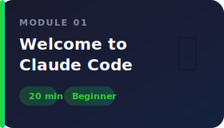</a></td>
<td align="center" width="20%"><a href="module-02-starting-your-first-project.md">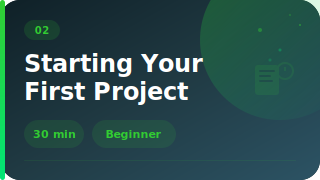</a></td>
<td align="center" width="20%"><a href="module-03-understanding-tools.md">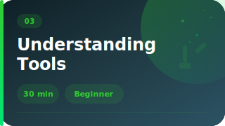</a></td>
<td align="center" width="20%"><a href="module-04-working-with-files.md">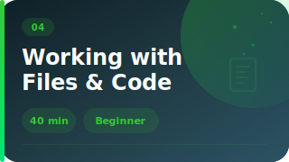</a></td>
<td align="center" width="20%"><a href="module-05-prompt-engineering.md">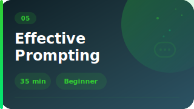</a></td>
</tr>
</table>
</div>

<br/>

<div align="center">

### 🔵 Core Skills (Modules 6–10)

*Build real things — agents, Git workflows, debugging, testing, and professional practices.*

</div>

<div align="center">
<table width="100%">
<tr>
<td align="center" width="20%"><a href="module-06-background-agents.md"></a></td>
<td align="center" width="20%"><a href="module-07-git-operations.md">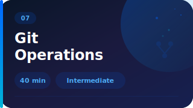</a></td>
<td align="center" width="20%"><a href="module-08-debugging-and-testing.md">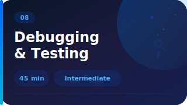</a></td>
<td align="center" width="20%"><a href="module-09-real-world-project.md">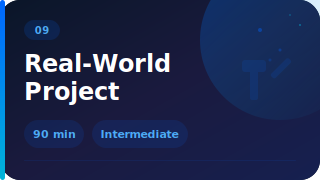</a></td>
<td align="center" width="20%"><a href="module-10-workflow-best-practices.md">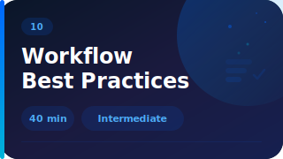</a></td>
</tr>
</table>
</div>

<br/>

<div align="center">

### 🟣 Going Deeper (Modules 11–15)

*Extend Claude Code with MCP, skills, hooks, multi-language support, APIs, and deployment.*

</div>

<div align="center">
<table width="100%">
<tr>
<td align="center" width="20%"><a href="module-11-mcp-servers.md">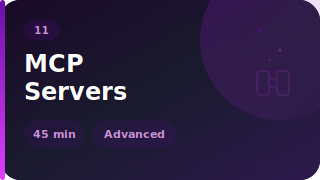</a></td>
<td align="center" width="20%"><a href="module-12-skills-and-hooks.md">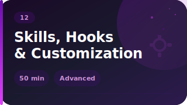</a></td>
<td align="center" width="20%"><a href="module-13-languages-and-frameworks.md">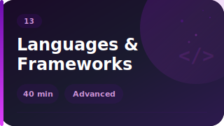</a></td>
<td align="center" width="20%"><a href="module-14-api-integration.md">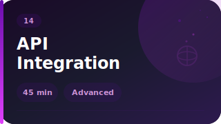</a></td>
<td align="center" width="20%"><a href="module-15-production-deployment.md">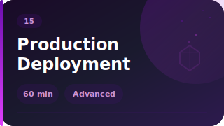</a></td>
</tr>
</table>
</div>

<br/>

<div align="center">

> ⏱ **Total: ~9 hours** — go at your own pace. Skip what you know, spend extra time on what challenges you.

</div>

<br/>

---

<br/>

<!-- CHALLENGES -->

<div align="center">

## 🏆 Challenges

*Practice makes perfect — each module includes hands-on challenges*

</div>

<br/>

<div align="center">
<table width="100%">
<tr>
<td align="center" width="25%">

### 🟢
**Beginner**

Basic concepts<br/>Single tasks<br/>Guided steps

</td>
<td align="center" width="25%">

### 🟡
**Intermediate**

Multiple concepts<br/>Less guidance<br/>Combining skills

</td>
<td align="center" width="25%">

### 🟠
**Advanced**

Complex features<br/>Best practices<br/>Real-world patterns

</td>
<td align="center" width="25%">

### 🔴
**Expert**

Production-ready<br/>Full implementations<br/>Professional quality

</td>
</tr>
</table>
</div>

<br/>

<div align="center">

<a href="supplement-challenge-solutions.md"></a>

*Try each challenge yourself first!*

</div>

<br/>

---

<br/>

<!-- PREREQUISITES -->

<div align="center">

## 📋 Prerequisites

</div>

<br/>

<div align="center">
<table width="100%">
<tr>
<td width="50%">

**What you need:**
- 💻 A computer (macOS, Windows, or Linux)
- 🌐 Internet connection
- ⌨️ Terminal access (we'll show you how)
- 🔑 Claude account (Pro/Max subscription or API key)

</td>
<td width="50%">

**What you DON'T need:**
- ❌ Prior programming experience
- ❌ Computer science degree
- ❌ Expensive software
- ❌ Previous AI experience

</td>
</tr>
</table>
</div>

<br/>

---

<br/>

<!-- HELP -->

<div align="center">

## 📚 Need Help?

</div>

<br/>

<div align="center">
<table width="100%">
<tr>
<td align="center" width="25%">

### 🔧
**[Troubleshooting](supplement-troubleshooting.md)**

Common errors<br/>and solutions

</td>
<td align="center" width="25%">

### 📋
**[Quick Reference](supplement-quick-reference.md)**

Commands, CLAUDE.md,<br/>rules, hooks

</td>
<td align="center" width="25%">

### 📖
**[Official Docs](https://github.com/anthropics/claude-code)**

Claude Code<br/>documentation

</td>
<td align="center" width="25%">

### 🐛
**[Report Issues](https://github.com/anthropics/claude-code/issues)**

Bugs and<br/>feature requests

</td>
</tr>
</table>
</div>

<br/>

---

<br/>

<!-- KEY CONCEPTS -->

<details>
<summary><h2>💡 Key Concepts for Beginners</h2></summary>

<br/>

### What is "AI Pair Programming"?

> 🤝 **AI Pair Programming** is working alongside AI to build software. Instead of writing every line yourself, you describe what you want and AI helps implement it. It's like having an expert developer sitting next to you, ready to help with any task.

### Understanding the CLI

Claude Code runs in your terminal. Don't be intimidated! We'll teach you everything you need to know.

### How Claude Code Works

```
  1. You describe what you want to build         💬
  2. Claude Code asks clarifying questions        🤔
  3. It reads files, writes code, runs commands   ⚙️
  4. You review the changes and give feedback     👀
  5. Iterate until you have what you want         🔄
```

### Tools Explained Simply

| Tool | What It Does | In Plain English |
|------|-------------|-----------------|
| **Read** | Opens files | *"Show me this file"* |
| **Write** | Creates files | *"Create this new file"* |
| **Edit** | Modifies files | *"Change this specific part"* |
| **Bash** | Runs commands | *"Run this command"* |
| **Task** | Delegates work | *"Handle this complex task"* |
| **Grep** | Searches code | *"Find this text in my code"* |

</details>

<br/>

---

<br/>

<!-- NEXT STEPS -->

<div align="center">

## 🚀 After This Course

</div>

<br/>

<div align="center">
<table width="100%">
<tr>
<td align="center" width="33%">

### 🔨 Build
Create your own apps, tools, and side projects with confidence

</td>
<td align="center" width="33%">

### 🌍 Contribute
Navigate open source codebases and make meaningful contributions

</td>
<td align="center" width="33%">

### 📈 Grow
Integrate Claude Code into professional workflows and level up

</td>
</tr>
</table>
</div>

<br/>

---

<br/>

<!-- PREMIUM CONTENT -->

<div align="center">

## 🔨 Keep Building

*The free course teaches you how. The paid content gives you what to build and where to go next.*

</div>

<br/>

<details open>
<summary>

### 📦 You've learned the tools — now build something real

</summary>

<br/>

In Module 9 you built one complete project. The **[Real Projects Pack ($39.99)](https://payhip.com/b/dFXWO)** gives you **11 more** — each designed around skills from this course:

<div align="center">
<table width="100%">
<tr><th>Free Module You Completed</th><th>🔨 Project You'll Build</th></tr>
<tr><td>Modules 3-4 <em>(tools + files)</em></td><td>Code Review Tool · Documentation Generator · Bug Finder</td></tr>
<tr><td>Module 5 <em>(prompting)</em></td><td>AI-Powered Todo App with Claude API</td></tr>
<tr><td>Module 8 <em>(testing)</em></td><td>Test Case Generator with TDD workflows</td></tr>
<tr><td>Module 11 <em>(MCP)</em></td><td>Claude Code Power Config (full <code>.claude/</code> setup)</td></tr>
<tr><td>Module 14 <em>(APIs)</em></td><td>API Client Builder from OpenAPI specs</td></tr>
<tr><td>Module 15 <em>(deployment)</em></td><td>Microservice Template · Full-Stack SaaS Boilerplate</td></tr>
<tr><td>🎁 Bonus</td><td>Database Schema Designer · CLI Tool Starter Kit</td></tr>
</table>
</div>

Every project includes CLAUDE.md templates, rules files, and copy-paste prompts.

<div align="center">

<a href="https://payhip.com/b/dFXWO"></a>

</div>

</details>

<details>
<summary>

### 🎓 You've deployed one app — now do it at scale

</summary>

<br/>

The **[Advanced Modules ($29.99)](https://payhip.com/b/8E107)** take you from "it works on my machine" to production infrastructure:

<div align="center">
<table width="100%">
<tr><th>You Liked...</th><th>Go Deeper With...</th></tr>
<tr><td>Module 6 <em>(agents)</em></td><td><b>M17:</b> Multi-agent orchestration · <b>M21:</b> Custom agents</td></tr>
<tr><td>Module 11 <em>(MCP)</em></td><td><b>M18:</b> Production MCP servers, npm publishing</td></tr>
<tr><td>Module 12 <em>(customization)</em></td><td><b>M22:</b> Plugins, permissions, write-time quality</td></tr>
<tr><td>Module 15 <em>(deployment)</em></td><td><b>M16:</b> Kubernetes, auto-scaling, multi-region</td></tr>
<tr><td>Working in teams</td><td><b>M19:</b> SSO, RBAC, audit logging, GDPR</td></tr>
<tr><td>Cost management</td><td><b>M20:</b> Model routing, strategic compaction</td></tr>
<tr><td>Professional workflows</td><td><b>M23:</b> RPI methodology, monorepo patterns</td></tr>
</table>
</div>

<div align="center">

<a href="https://payhip.com/b/8E107"></a>

</div>

</details>

<details>
<summary>

### 🔥 Get both — Complete Bundle $59.99 (Save $10)

</summary>

<br/>

8 advanced modules + 11 project templates. The modules teach the patterns, the projects let you practice them.

<div align="center">

<a href="https://payhip.com/b/S8nU1"></a>

</div>

</details>

<br/>

---

<br/>

<!-- LEARNING PATHS -->

<details>
<summary><h2>🛤️ Learning Paths by Role</h2></summary>

<br/>

<div align="center">
<table width="100%">
<tr>
<td width="33%">

### 🌱 Aspiring Developers
- Building CLI tools
- Creating web applications
- Learning programming languages
- Understanding software architecture

</td>
<td width="33%">

### 💼 Experienced Developers
- Speeding up development workflows
- Navigating unfamiliar codebases
- Automating repetitive tasks
- Prototyping ideas quickly

</td>
<td width="33%">

### 🎒 Students
- Learning programming with AI guidance
- Completing assignments and projects
- Understanding complex algorithms
- Debugging homework

</td>
</tr>
</table>
</div>

</details>

<br/>

---

<br/>

<!-- FOOTER -->

<div align="center">

<br/>

### 💪 You don't need to be an expert to start building amazing things.

Claude Code makes it possible for anyone to create professional software.<br/>
This course will guide you from your first terminal command to your first deployed application.

<br/>

<a href="module-01-welcome-to-claude-code.md"></a>

<br/>
<br/>

---

*Last updated: March 2026*

<br/>

[](https://buymeacoffee.com/koki7o)

</div>
